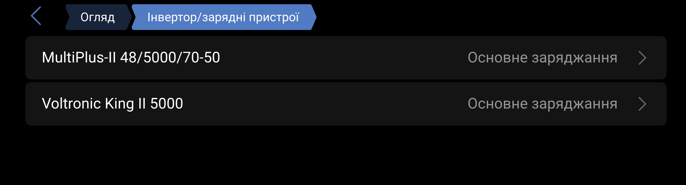
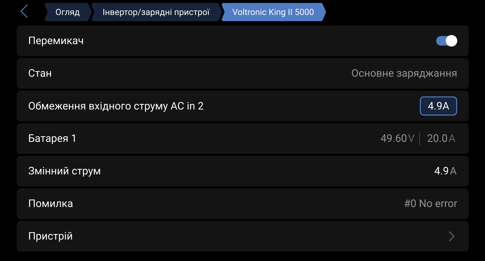

# dbus-voltronic-charger

Venus OS driver for exposing a Voltronic King II 5000 as an additional
`com.victronenergy.charger` service on a Cerbo GX.

The driver publishes battery-side charger telemetry, AC input/output data,
charger state, errors and guarded current/mode controls. Setting commands are
disabled by default and must be explicitly enabled in `config.ini`.

## Venus OS integration

The Voltronic charger appears alongside the native Victron inverter/chargers:



The device page exposes the standard charger switch and AC input-current limit.
This live capture shows `49.60 V`, `20.0 A` DC charging, an estimated `4.9 A`
AC input current and no active error:



## Confirmed target

- Inverter: Voltronic King II 5000.
- Protocol identity: `PI30`.
- Model response: `KING-5000`.
- Serial speed: 2400 baud, 8N1.
- Venus OS: v3.80 on Cerbo GX.
- Application directory: `/data/apps/dbus-voltronic-charger`.
- Configured inverter port: `/dev/ttyUSB1`.
- Tested adapter: CH340/CH341, VID:PID `1a86:7523`.

The serial port is mandatory configuration. The driver never guesses another
port and its lifecycle scripts operate only on the configured tty. In the
confirmed installation, Pylontech remains on `/dev/ttyUSB0` and is not touched.

## D-Bus data model

The default service name is
`com.victronenergy.charger.voltronic_king2`.

Standard charger paths include:

- `/Connected`, `/DeviceInstance`, `/ProductName`, `/CustomName`;
- `/Dc/0/Voltage`, `/Dc/0/Current`, `/Dc/0/Power`;
- `/State`, `/Mode`, `/ErrorCode`, `/NrOfOutputs`;
- `/Ac/In/L1/V`, `/Ac/In/L1/F`, `/Ac/In/L1/I`, `/Ac/In/L1/P`;
- `/Ac/In/CurrentLimit`;
- `/Ac/Out/L1/V`, `/Ac/Out/L1/F`, `/Ac/Out/L1/P`, `/Ac/Out/L1/S`;
- `/Ac/Out/L1/LoadPercentage`.

Driver-specific paths include:

- `/Settings/ChargeCurrentLimit`: total DC charging-current limit;
- `/Settings/UtilityChargeCurrentLimit`: utility charger DC-current limit;
- `/Capabilities/ChargeCurrentLimits`: live `QMCHGCR` choices;
- `/Capabilities/UtilityChargeCurrentLimits`: live `QMUCHGCR` choices;
- `/Protocol/*`: identity, source flags, raw charging values and diagnostics.

`/State` is `3` while AC charging is active and `0` otherwise. PI30 does not
provide enough information to claim specific Absorption or Float states.

### Current and power attribution

QPIGS reports one battery charging-current value. The driver publishes it as
the AC charger's `/Dc/0/Current` only during AC-only charging and calculates
`/Dc/0/Power` once as battery voltage multiplied by current.

PV charging power remains under `/Protocol/PvChargingPower`; it is not added to
the standard charger power. During simultaneous AC and SCC charging, standard
DC current and power are invalidated because PI30 cannot split the two sources
reliably. This avoids fabricated values and double counting.

### Estimated AC input

Classic 21-field PI30 QPIGS does not report measured AC input current or power.
For AC-only charging the driver estimates them as:

```text
AC input power = battery voltage * DC charge current / efficiency + self consumption
AC input current = AC input power / AC input voltage
```

The defaults are 70 W self-consumption and 95% efficiency. Both are
configurable. `/Protocol/AcInputPowerEstimated=1` marks these values as
estimated. AC output load is deliberately not added to the charger estimate.

### Current control

The inverter supplies its valid DC current choices through `QMCHGCR` and
`QMUCHGCR`; the driver does not hard-code them. Every write must use a live
choice, receive `(ACK`, and match the following `QPIRI` read-back.

The standard `/Ac/In/CurrentLimit` uses AC amperes. The driver converts it to a
DC utility-charger budget using live AC and battery voltage, configured
efficiency and self-consumption, then selects the highest live `QMUCHGCR`
choice that does not exceed that budget.

For an exact battery-side limit, write the DC extension directly:

```sh
dbus -y com.victronenergy.charger.voltronic_king2 \
  /Settings/UtilityChargeCurrentLimit SetValue 20
```

On the confirmed single King II, `parallel_unit=0` produces `MUCHGC0020` for a
20 A utility DC limit. The live inverter accepted this frame and reported
20.0 A charging after read-back verification.

`/Settings/ChargeCurrentLimit` is the total AC+PV charging limit. The inverter
enforces both settings, so actual utility charging cannot exceed either one.

### Mode control

`/Mode` follows the charger convention `1=On`, `4=Off`. Off selects charger
source priority `3` (solar only). On restores the last known enabled priority,
or `enabled_charger_source_priority` after a restart. The live King II has
confirmed both transitions with QPIRI read-back.

## Configuration

Start from `config.ini.example`. The essential settings are:

```ini
[serial]
port = /dev/ttyUSB1
baudrate = 2400
timeout = 2.0
command_delay = 0.5

[protocol]
profile = pi30
publish_battery_charging_current = true

[power_estimation]
self_consumption_watts = 70
ac_to_dc_efficiency_percent = 95

[control]
allow_current_limit_writes = false
parallel_unit = 0
allow_mode_writes = false
enabled_charger_source_priority =

[device]
device_instance =
service_name = com.victronenergy.charger.voltronic_king2
```

Choose an unused charger-class `device_instance` before activation:

```sh
dbus -y | grep 'com.victronenergy.charger' || true
dbus -y SERVICE_NAME /DeviceInstance GetValue
```

Set `allow_current_limit_writes=true` and `allow_mode_writes=true` only when
remote control is intentional. When On must work after restarting in
solar-only mode, set `enabled_charger_source_priority` to `0`, `1`, or `2`.

## Fresh installation on Cerbo

Download and extract the packaged release:

```sh
cd /data
wget -O dbus-voltronic-charger-0.6.1.tar.gz \
  https://raw.githubusercontent.com/stas-dovgodko/dbus-voltronic-charger/main/dist/dbus-voltronic-charger-0.6.1.tar.gz
tar -xzf dbus-voltronic-charger-0.6.1.tar.gz
cd dbus-voltronic-charger-0.6.1
chmod +x install.sh activate.sh deactivate.sh uninstall.sh serial-port.sh
./install.sh
```

The installer copies the application to `/data/apps/dbus-voltronic-charger`,
preserves an existing `config.ini`, and leaves the service inactive.

Edit the installed configuration and run the inquiry/read-back check:

```sh
vi /data/apps/dbus-voltronic-charger/config.ini
cd /data/apps/dbus-voltronic-charger
PYTHONPATH=. /usr/bin/python3 -m voltronic_charger.main \
  --config ./config.ini --once
```

Activate only after the one-shot output identifies `PI30` and `KING-5000`:

```sh
./activate.sh --confirm-pi30
sleep 8
svstat /service/dbus-voltronic-charger
tail -n 30 /var/log/dbus-voltronic-charger/current
```

## Updating

The installer intentionally refuses to overwrite an active service. Deactivate
the installed version first, then run the new installer:

```sh
cd /data/apps/dbus-voltronic-charger
./deactivate.sh

cd /data/dbus-voltronic-charger-0.6.1
./install.sh

cd /data/apps/dbus-voltronic-charger
./activate.sh --confirm-pi30
sleep 8
dbus -y com.victronenergy.charger.voltronic_king2 /DriverVersion GetValue
```

The installer creates a timestamped backup and preserves `config.ini`.

## Serial ownership

Before each start, `serial-port.sh acquire` resolves the configured path to its
tty basename and calls Venus `stop-tty.sh` for that tty only. Venus OS v3.80
does not provide `timeout`, so the project uses a bounded POSIX-shell watchdog.
It does not stop global `serial-starter` or target another USB adapter.

Deactivation releases the same configured tty through `start-tty.sh`:

```sh
/data/apps/dbus-voltronic-charger/deactivate.sh
```

Recoverable uninstall:

```sh
/data/apps/dbus-voltronic-charger/uninstall.sh
```

The uninstaller moves the application to a timestamped `.removed.*` directory
instead of recursively deleting it.

## Verification and development

```sh
python3 -m unittest discover -s tests -v
python3 -m compileall -q voltronic_charger
sh -n install.sh activate.sh deactivate.sh uninstall.sh serial-port.sh \
  service/run service/log/run
```

The test suite covers protocol framing, live King II response parsing, dynamic
current capabilities, guarded writes, ACK/NAK handling, QPIRI verification,
mode control, serial pacing, AC/DC publication, mixed-source protection and
packaging safety.

## Known limits

- AC input current and power are estimates, not measurements.
- AC+SCC charging cannot be split with the confirmed 21-field QPIGS response.
- `/Ac/In/CurrentLimit` is a charger-only AC budget; it does not include loads
  supplied through the King AC output.
- The runtime currently requires exact live identity `PI30` and `KING-5000`.

See [HANDOFF.md](HANDOFF.md) for captured protocol evidence and remaining live
validation notes.
